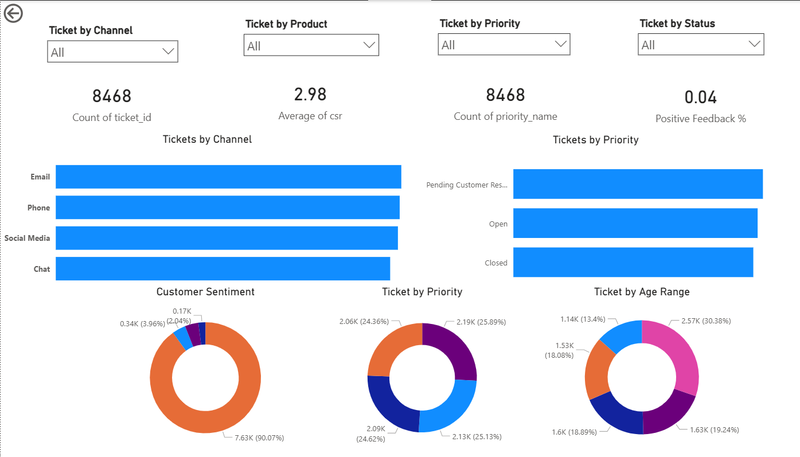

# 📊 Customer Support Ticket Analysis Dashboard

## 📌 Overview

This project analyzes customer support ticket data to uncover insights related to ticket volume, customer satisfaction, and issue distribution.

## 🛠 Tools Used

* SQL (PostgreSQL)
* Power BI

## 🔍 Key Insights

* Identified top channels generating maximum support tickets
* Analyzed distribution of high-priority tickets
* Evaluated customer satisfaction using CSR scores
* Highlighted products with frequent issues

## 📈 Dashboard Features

* KPI Cards (Total Tickets, Avg CSR, Positive Feedback %)
* Ticket distribution by Channel and Product
* Customer sentiment analysis
* Time-based ticket trends
* Interactive slicers (Channel, Product, Priority, Status)

## 📂 Files Included

* `dashboard.pbix` – Power BI dashboard
* `dataset.csv` – Processed dataset
* `analysis.sql` – SQL queries used for data cleaning and transformation
* `dashboard.png` – Dashboard preview

## 🚀 Learnings

* Data cleaning and transformation using SQL
* Handling data mismatches during joins
* Building interactive dashboards in Power BI
* Creating business insights from raw data

## 📷 Dashboard Preview

